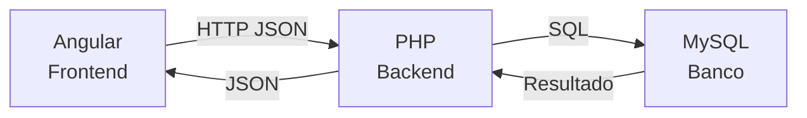
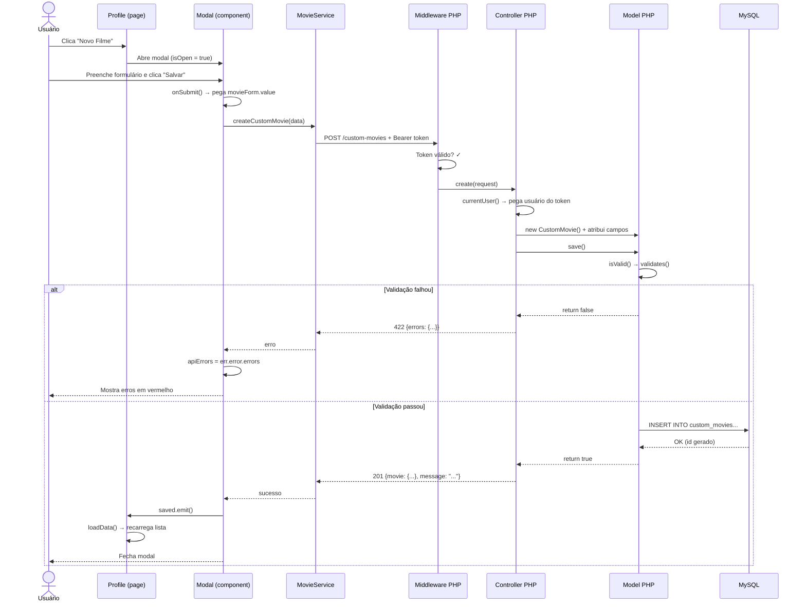

# Fluxo Geral do CRUD de Filmes Personalizados

## 🗺️ Visão Geral

O CRUD de filmes personalizados funciona assim: o **Angular** (frontend) envia dados via HTTP para o **PHP** (backend), que valida e salva no **MySQL** (banco).



---

## 📂 Mapa dos Arquivos

### Frontend (Angular)
```
mymovies-angular/src/app/
├── components/custom-movie-modal/
│   ├── custom-movie-modal.ts    ← Lógica do formulário
│   └── custom-movie-modal.html  ← Template HTML do modal
├── core/services/
│   └── movie.ts                 ← Serviço que faz as chamadas HTTP
├── core/guards/
│   └── auth-guard.ts            ← Protege rotas (só logados)
└── pages/profile/
    └── profile.ts               ← Página que abre o modal
```

### Backend (PHP)
```
mymovies/
├── config/routes.php                        ← Define as URLs da API
├── app/Controllers/CustomMoviesController.php ← Recebe requisições
├── app/Models/CustomMovie.php               ← Valida e salva no banco
├── app/Middleware/Authenticate.php           ← Verifica token JWT
├── lib/Validations.php                      ← Funções de validação
├── core/Http/Controllers/Controller.php     ← Classe base (json(), currentUser())
├── core/Database/ActiveRecord/Model.php     ← Classe base (save(), isValid())
└── database/schema.sql                      ← Estrutura das tabelas
```

---

## 🔄 Fluxo Completo: Criar um Filme



---

## 🔍 Código-Chave em Cada Camada

### 1. Profile abre o modal

```typescript
// pages/profile/profile.ts

// Variáveis que controlam o modal
isModalOpen = false;
movieToEdit: any = null;
modalMode: 'tmdb' | 'custom' = 'tmdb';

// Para CRIAR um novo filme (movieToEdit = null, mode = 'custom')
// O botão "Novo Filme" no HTML faz: isModalOpen = true; movieToEdit = null;

// Para EDITAR (movieToEdit = filme existente)
openModal(movie: any) {
    this.movieToEdit = movie;
    this.modalMode = movie.isCustom ? 'custom' : 'tmdb';
    this.isModalOpen = true;
}

// Quando o modal salva com sucesso → recarrega os dados
onSaved() {
    this.loadData();  // Busca lista atualizada do backend
}
```

---

### 2. Modal monta o formulário e envia

```typescript
// components/custom-movie-modal/custom-movie-modal.ts

// initForm() — monta os campos do formulário
initForm() {
    this.movieForm = this.fb.group({
        title: [{ value: '', disabled: false }],
        description: [{ value: '', disabled: false }],
        release_year: [{ value: '', disabled: false }],
        poster_url: [{ value: '', disabled: false }],
        rating: [{ value: '', disabled: false }],
        status: [{ value: '', disabled: false }],
    });
}

// onSubmit() — envia para o backend
onSubmit() {
    this.isSubmitting = true;
    this.apiErrors = {};
    const data = this.movieForm.value;
    // data = {title: "Matrix", description: "...", rating: 5, ...}

    this.movieService.createCustomMovie(data).subscribe({
        next: () => {        // Sucesso (201)
            this.saved.emit();
            this.closeModal();
        },
        error: (err) => {    // Erro (422)
            if (err.status === 422 && err.error?.errors) {
                this.apiErrors = err.error.errors;
                // apiErrors = {title: "O título é obrigatório!", ...}
            }
        }
    });
}
```

---

### 3. MovieService faz a requisição HTTP

```typescript
// core/services/movie.ts

// CREATE — POST
createCustomMovie(movie: any): Observable<any> {
    return this.http.post<any>(`${this.API_URL}/custom-movies`, movie);
    // Envia: POST http://localhost:8080/custom-movies
    // Body: {"title": "Matrix", "description": "...", ...}
    // Header: Authorization: Bearer xxx (adicionado pelo interceptor)
}

// READ — GET
getCustomMovies(): Observable<any> {
    return this.http.get<any>(`${this.API_URL}/custom-movies`);
}

// UPDATE — PUT
updateCustomMovie(id: number, movie: any): Observable<any> {
    return this.http.put<any>(`${this.API_URL}/custom-movies/${id}`, movie);
}

// DELETE — DELETE
deleteCustomMovie(id: number): Observable<any> {
    return this.http.delete<any>(`${this.API_URL}/custom-movies/${id}`);
}
```

> **CRUD ↔ HTTP**: **C**reate = POST, **R**ead = GET, **U**pdate = PUT, **D**elete = DELETE

---

### 4. Rota PHP recebe e direciona pro Controller

```php
// config/routes.php

Route::middleware('auth')->group(function () {
    Route::get('/custom-movies',      [CustomMoviesController::class, 'index']);   // Listar
    Route::post('/custom-movies',     [CustomMoviesController::class, 'create']);  // Criar
    Route::put('/custom-movies/{id}', [CustomMoviesController::class, 'update']);  // Atualizar
    Route::delete('/custom-movies/{id}', [CustomMoviesController::class, 'delete']); // Deletar
});
// O middleware('auth') roda Authenticate.php ANTES de chegar no Controller
```

---

### 5. Controller recebe os dados e cria o Model

```php
// app/Controllers/CustomMoviesController.php

public function create(Request $request): void
{
    // 5a. Verifica se o usuário está logado
    $user = $this->currentUser();
    if (!$user) {
        $this->json(['error' => 'Não autorizado'], 401);
        return;
    }

    // 5b. Lê o JSON que o frontend enviou
    $json = file_get_contents('php://input');
    $data = json_decode($json, true);
    // $data = ['title' => 'Matrix', 'description' => '...', ...]

    // 5c. Cria o Model e atribui os campos
    $movie = new CustomMovie();
    $movie->user_id = $user->id;
    $movie->title = !empty($data['title']) ? $data['title'] : null;
    $movie->description = !empty($data['description']) ? $data['description'] : null;
    // ... outros campos

    // 5d. Tenta salvar (valida automaticamente)
    if ($movie->save()) {
        $this->json(['movie' => $movie, 'message' => 'Filme cadastrado!'], 201);
    } else {
        $this->json(['errors' => $movie->errors()], 422);
    }
}
```

**Funções-chave do Controller base:**
- `$this->currentUser()` → decodifica o JWT e retorna o User
- `$this->json($dados, $status)` → envia resposta JSON com status HTTP
- `file_get_contents('php://input')` → lê o body da requisição

---

### 6. Model valida e salva

```php
// app/Models/CustomMovie.php

// 6a. validates() — regras de negócio
public function validates(): void
{
    Validations::notEmpty('title', $this, 'O título é obrigatório!');
    Validations::notEmpty('status', $this, 'O status é obrigatório.');
    // ... mais regras
}

// core/Database/ActiveRecord/Model.php

// 6b. save() — orquestra tudo
public function save(): bool
{
    if ($this->isValid()) {          // Chama validates()
        // Monta o SQL e executa
        // INSERT INTO custom_movies (title, ...) VALUES (:title, ...)
        $this->id = (int) $pdo->lastInsertId();
        return true;
    }
    return false;                    // Tem erros, não salvou
}

// 6c. errors() — retorna os erros acumulados
public function errors(): array
{
    return $this->errors;
    // ['title' => 'O título é obrigatório!', 'status' => 'O status é obrigatório.']
}
```

---

## 📊 Resumo: Quem Faz O Quê

| Camada | Arquivo | Responsabilidade |
|---|---|---|
| **Página** | `profile.ts` | Abre/fecha o modal, recarrega dados |
| **Modal** | `custom-movie-modal.ts` | Formulário, submit, exibir erros |
| **Service** | `movie.ts` | Chamadas HTTP (POST, GET, PUT, DELETE) |
| **Guard** | `auth-guard.ts` | Bloqueia navegação se não logado |
| **Rotas** | `routes.php` | Mapeia URL → Controller + aplica middleware |
| **Middleware** | `Authenticate.php` | Valida token JWT antes do Controller |
| **Controller** | `CustomMoviesController.php` | Recebe dados, monta Model, retorna JSON |
| **Model** | `CustomMovie.php` | Validação de campos, INSERT/UPDATE/DELETE |
| **Base Model** | `Model.php` | `save()`, `isValid()`, `findById()`, etc. |
| **Validations** | `Validations.php` | `notEmpty()`, `uniqueness()` reutilizáveis |
| **Banco** | `schema.sql` | Estrutura da tabela `custom_movies` |
