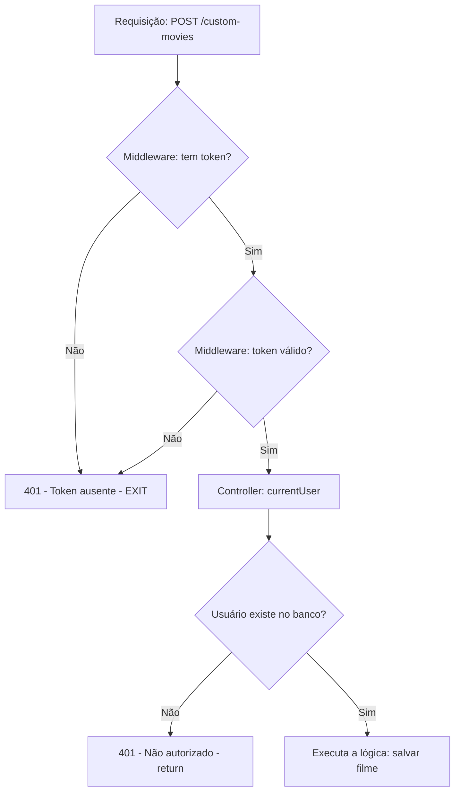
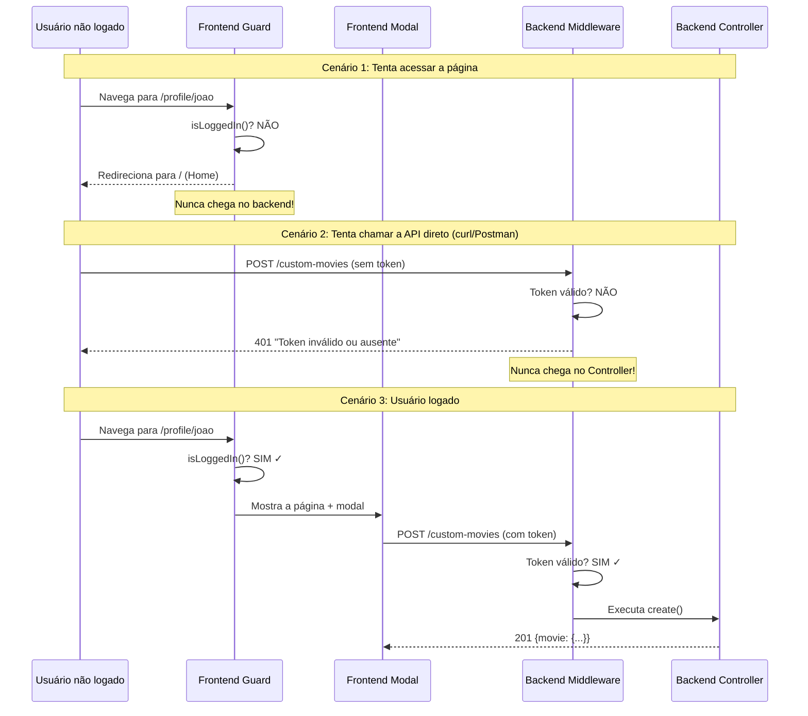

# Tutorial: Bloqueio de Páginas para Usuários Não Autenticados

## 🎯 O Objetivo

Impedir que usuários **não logados** acessem certas páginas ou executem certas funções. No nosso caso: bloquear o CRUD de filmes personalizados.

A proteção acontece em **duas camadas**:

| Camada | Onde | O que faz |
|---|---|---|
| **Backend (PHP)** | Middleware + Controller | Rejeita requisições sem token válido |
| **Frontend (Angular)** | Guards + Rotas | Impede navegação para páginas protegidas |

> [!IMPORTANT]
> A proteção no **backend** é a que realmente importa para segurança. A do frontend é apenas UX (esconde botões e redireciona), mas pode ser burlada facilmente.

---

## 📂 Arquivos Envolvidos

### Backend (PHP)
| Arquivo | Caminho | Papel |
|---|---|---|
| `Authenticate.php` | `app/Middleware/Authenticate.php` | Middleware que valida o token JWT |
| `routes.php` | `config/routes.php` | Define quais rotas são protegidas |
| `CustomMoviesController.php` | `app/Controllers/CustomMoviesController.php` | Verifica usuário dentro de cada método |
| `Controller.php` (base) | `core/Http/Controllers/Controller.php` | Método `currentUser()` |

### Frontend (Angular)
| Arquivo | Caminho | Papel |
|---|---|---|
| `auth-guard.ts` | `src/app/core/guards/auth-guard.ts` | Guard que verifica se está logado |
| `app.routes.ts` | `src/app/app.routes.ts` | Define quais rotas usam o guard |

---

## 🔒 PARTE 1: Proteção no Backend

### 1.1 — O Middleware de Autenticação

O arquivo `app/Middleware/Authenticate.php` **já existe** no projeto:

```php
class Authenticate implements Middleware
{
    public function handle(Request $request): void
    {
        // 1. Pega o header Authorization
        $authHeader = $_SERVER['HTTP_AUTHORIZATION'] ?? '';
        $token = null;

        // 2. Extrai o token do formato "Bearer xxx..."
        if (preg_match('/Bearer\s(\S+)/', $authHeader, $matches)) {
            $token = $matches[1];
        }

        // 3. Se não tem token OU token inválido → bloqueia
        if (!$token || !Auth::validateToken($token)) {
            $this->unauthorized();
        }
    }

    protected function unauthorized(): void
    {
        header('Content-Type: application/json');
        http_response_code(401);
        echo json_encode(['error' => 'Token inválido ou ausente']);
        exit;  // Para a execução! O Controller nem é chamado.
    }
}
```

#### Conceito: O que é um Middleware?

Middleware é um **filtro** que roda **antes** do Controller. Pense nele como um segurança na porta:

```
Requisição → [Middleware] → Controller → Resposta
                  ↓
            Sem token?
            → 401 + exit (nunca chega no Controller)
```

> [!NOTE]
> O `exit` no `unauthorized()` é crucial. Ele **para tudo**. O Controller nunca é executado se o middleware rejeitar.

---

### 1.2 — Como as Rotas São Protegidas

No `config/routes.php`, as rotas de custom-movies **já estão** dentro de um grupo protegido:

```php
// config/routes.php — linhas 18-31

// Rotas PÚBLICAS (qualquer pessoa acessa):
Route::post('/auth/login', [UsersController::class, 'login']);
Route::post('/auth/register', [UsersController::class, 'create']);
Route::get('/movies', [HomeController::class, 'index']);

// Rotas PROTEGIDAS (só usuários logados):
Route::middleware('auth')->group(function () {       // ← O middleware 'auth'
    Route::get('/custom-movies', [CustomMoviesController::class, 'index']);
    Route::post('/custom-movies', [CustomMoviesController::class, 'create']);
    Route::put('/custom-movies/{id}', [CustomMoviesController::class, 'update']);
    Route::delete('/custom-movies/{id}', [CustomMoviesController::class, 'delete']);
});
```

#### Conceito: `Route::middleware('auth')->group()`

- `middleware('auth')` → usa o middleware `Authenticate.php`
- `group(function() {...})` → aplica o middleware a **todas** as rotas dentro do grupo
- Assim você não precisa verificar autenticação em cada Controller individualmente

**Mapeamento middleware ↔ classe** (está na configuração do projeto):
| Nome | Classe |
|---|---|
| `'auth'` | `App\Middleware\Authenticate` |
| `'admin'` | `App\Middleware\AdminAuthenticate` |

---

### 1.3 — Proteção EXTRA no Controller

Mesmo com middleware, o Controller **também verifica** o usuário. Isso é uma **segunda camada**:

```php
// app/Controllers/CustomMoviesController.php

public function create(Request $request): void
{
    $user = $this->currentUser();    // Tenta pegar o usuário pelo token
    if (!$user) {                    // Se não conseguiu
        $this->json(['error' => 'Não autorizado'], 401);
        return;                      // Para aqui, não salva nada
    }

    // ... só chega aqui se tem usuário válido
    $movie = new CustomMovie();
    $movie->user_id = $user->id;     // Usa o ID do usuário logado
    // ...
}
```

#### Por que verificar nos DOIS lugares?

| Proteção | Protege contra | Exemplo |
|---|---|---|
| **Middleware** | Requisições sem token | Alguém acessando direto pelo navegador ou curl |
| **Controller** | Token válido mas usuário deletado | Token antigo de um usuário que foi removido do banco |

> [!TIP]
> O `currentUser()` (em `core/Http/Controllers/Controller.php`) decodifica o token JWT e busca o usuário no banco. Se o token é válido mas o usuário não existe mais, retorna `null`.

---

### 1.4 — Como `currentUser()` Funciona

```php
// core/Http/Controllers/Controller.php — linhas 19-28

public function currentUser(): ?User
{
    if ($this->current_user === null) {
        // Pega o header "Authorization: Bearer xxxxx"
        $token = $_SERVER['HTTP_AUTHORIZATION'] ?? '';

        // Extrai o token
        if (preg_match('/Bearer\s(\S+)/', $token, $matches)) {
            // Decodifica o JWT e retorna o User
            $this->current_user = Auth::user($matches[1]);
        }
    }
    return $this->current_user;  // User ou null
}
```

O fluxo completo de uma requisição protegida:



---

## 🔒 PARTE 2: Proteção no Frontend (Angular)

### 2.1 — O Auth Guard

O arquivo `src/app/core/guards/auth-guard.ts` **já existe**:

```typescript
export const authGuard: CanActivateFn = (route, state) => {
    const authService = inject(Auth);
    const router = inject(Router);

    if (authService.isLoggedIn()) {
        return true;   // Permite acessar a rota
    }

    router.navigate(['/']);  // Redireciona para home
    return false;            // Bloqueia a rota
};
```

#### Conceito: O que é um Guard?

Guard é o equivalente Angular do middleware. Ele roda **antes** de carregar um componente de página:

```
Usuário clica em link → [Guard] → Componente da página
                           ↓
                     Não logado?
                     → Redireciona para Home
```

### 2.2 — Rotas Protegidas no Angular

No `src/app/app.routes.ts`, as rotas usam `canActivate`:

```typescript
export const routes: Routes = [
    // Rota PÚBLICA — qualquer pessoa acessa
    {
        path: '',
        component: Home,
    },

    // Rota PROTEGIDA — só logados
    {
        path: 'profile/:username',
        component: Profile,
        canActivate: [authGuard],    // ← Guard aqui!
    },

    // Rota PROTEGIDA com DOIS guards
    {
        path: 'admin',
        component: Admin,
        canActivate: [authGuard, adminGuard],  // Precisa estar logado E ser admin
    },
];
```

> [!NOTE]
> A página de Profile (onde fica o CRUD de custom movies) **já está protegida** pelo `authGuard`. Se o usuário não estiver logado e tentar acessar `/profile/xxx`, é redirecionado para `/`.

---

## 📖 Conceito: As Duas Camadas Juntas



---

## ⚠️ Erros Comuns

### 1. Confiar só no frontend
```
❌ ERRADO: "Escondi o botão, então não preciso proteger no backend"
✅ CORRETO: Sempre proteger no backend (middleware + controller)
```
Qualquer pessoa pode abrir o DevTools do navegador, achar a URL da API, e fazer a requisição com curl. O frontend é apenas conveniência.

### 2. Esquecer a rota fora do grupo de middleware
```php
// ❌ ERRADO — rota desprotegida!
Route::post('/custom-movies', [CustomMoviesController::class, 'create']);

Route::middleware('auth')->group(function () {
    // ...outras rotas protegidas
});

// ✅ CORRETO — dentro do grupo
Route::middleware('auth')->group(function () {
    Route::post('/custom-movies', [CustomMoviesController::class, 'create']);
});
```

### 3. Esquecer o `return` após enviar 401
```php
// ❌ ERRADO — continua executando!
if (!$user) {
    $this->json(['error' => 'Não autorizado'], 401);
    // Falta o return! O código abaixo vai rodar!
}
$movie = new CustomMovie();  // Executa mesmo sem usuário!

// ✅ CORRETO — para a execução
if (!$user) {
    $this->json(['error' => 'Não autorizado'], 401);
    return;  // Para aqui!
}
```

### 4. Guard sem redirecionar
```typescript
// ❌ ERRADO — bloqueia mas o usuário fica numa página em branco
export const authGuard: CanActivateFn = () => {
    const auth = inject(Auth);
    return auth.isLoggedIn();  // false = tela branca
};

// ✅ CORRETO — redireciona para uma página válida
export const authGuard: CanActivateFn = () => {
    const auth = inject(Auth);
    const router = inject(Router);
    if (auth.isLoggedIn()) return true;
    router.navigate(['/']);   // Leva para a home
    return false;
};
```

---

## 📝 Resumo dos Conceitos

| Conceito | Explicação |
|---|---|
| **Middleware (PHP)** | Filtro que roda antes do Controller, valida o token JWT |
| **Guard (Angular)** | Filtro que roda antes de carregar a página, verifica se está logado |
| **`Route::middleware('auth')->group()`** | Protege um grupo de rotas no backend |
| **`canActivate: [authGuard]`** | Protege uma rota no frontend |
| **`currentUser()`** | Decodifica o token e retorna o User do banco |
| **HTTP 401** | Status "Unauthorized" — não autenticado |
| **HTTP 403** | Status "Forbidden" — autenticado mas sem permissão |
| **JWT (JSON Web Token)** | Token que o frontend envia no header `Authorization: Bearer xxx` |
| **Defesa em profundidade** | Proteger em múltiplas camadas (middleware + controller + frontend) |

### O que JÁ está implementado no projeto:

✅ Middleware `Authenticate.php` → valida token JWT  
✅ Rotas de custom-movies dentro de `middleware('auth')->group()`  
✅ Verificação `currentUser()` em cada método do Controller  
✅ Guard `authGuard` no Angular  
✅ Rota `/profile/:username` protegida com `canActivate`  

> [!TIP]
> Para a prova: o projeto **já tem tudo implementado**. O importante é entender **por que** cada camada existe e **como** elas funcionam juntas.
