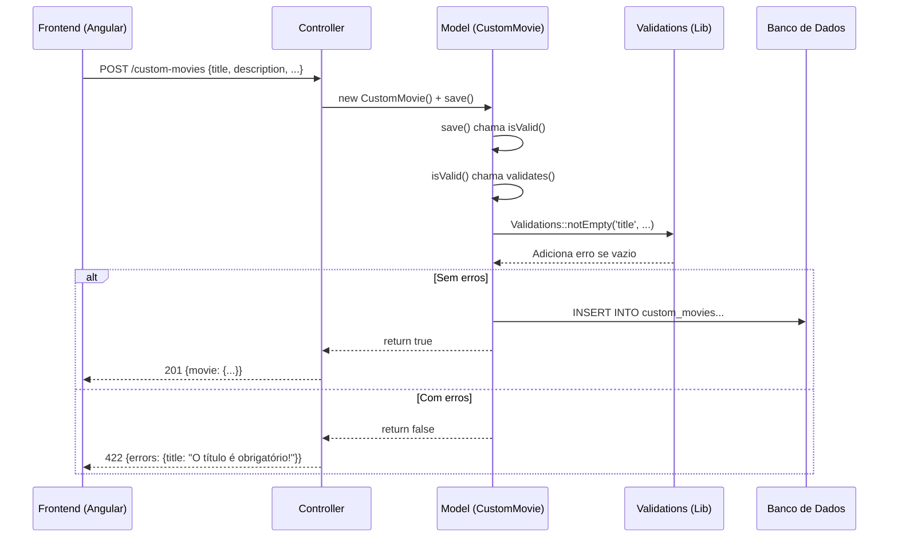

# Tutorial: Validação de Campos no Backend

## 🎯 O que é Validação no Backend?

Validação no backend é a verificação dos dados **no servidor** antes de salvar no banco. Mesmo que o frontend já valide, o backend DEVE validar também porque:

1. **Segurança**: qualquer pessoa pode burlar o frontend (ex: usando Postman ou curl)
2. **Integridade dos dados**: garante que o banco nunca receba lixo
3. **Regra de negócio centralizada**: a "verdade" fica num lugar só

> [!IMPORTANT]
> **Nunca confie apenas na validação do frontend!** O backend é a última barreira antes do banco de dados.

---

## 📂 Arquivos Envolvidos

| Arquivo | Caminho Relativo | Papel |
|---|---|---|
| **CustomMovie.php** (Model) | `app/Models/CustomMovie.php` | Define as regras de validação |
| **Validations.php** (Lib) | `lib/Validations.php` | Biblioteca de validações reutilizáveis |
| **Model.php** (Base) | `core/Database/ActiveRecord/Model.php` | Classe base que chama `validates()` antes de salvar |
| **CustomMoviesController.php** | `app/Controllers/CustomMoviesController.php` | Recebe os dados e retorna erros |

---

## 🔄 Como Funciona o Fluxo Atual



### Passo a passo no código:

**1. O Controller recebe os dados e chama `save()`:**
```php
// app/Controllers/CustomMoviesController.php (linha 43-47)
if ($movie->save()) {
    $this->json(['movie' => $movie], 201);       // Sucesso
} else {
    $this->json(['errors' => $movie->errors()], 422); // Erros de validação
}
```

**2. O `save()` da classe base Model chama `isValid()`:**
```php
// core/Database/ActiveRecord/Model.php (linha 153-157)
public function save(): bool
{
    if ($this->isValid()) {   // <-- Só salva se for válido!
        // ... INSERT ou UPDATE no banco
        return true;
    }
    return false;  // <-- Retorna false se tiver erros
}
```

**3. O `isValid()` chama `validates()` (que nós definimos no Model):**
```php
// core/Database/ActiveRecord/Model.php (linha 103-110)
public function isValid(): bool
{
    $this->errors = [];        // Limpa erros anteriores
    $this->validates();        // Chama NOSSAS regras
    return empty($this->errors); // Válido se não tem erros
}
```

**4. O nosso `validates()` define as regras:**
```php
// app/Models/CustomMovie.php (linha 35-62) — ATUAL
public function validates(): void
{
    Validations::notEmpty('user_id', $this, 'O ID do usuário é obrigatório!');
    Validations::notEmpty('title', $this, 'O título é obrigatório!');

    // Validação de rating (1-5)
    if ($this->rating !== null && $this->rating !== '') {
        if (!is_numeric($this->rating) || (int)$this->rating < 1 || (int)$this->rating > 5) {
            $this->addError('rating', 'A nota deve ser um número entre 1 e 5.');
        }
    }
    // ... mais validações de release_year e status
}
```

> [!NOTE]
> O método `addError('campo', 'mensagem')` vem da classe base `Model`. Ele guarda os erros num array associativo `['campo' => 'mensagem']`.

---

## ✅ Validações que JÁ existem no projeto

| Campo | Tipo de Validação | Mensagem |
|---|---|---|
| `user_id` | `notEmpty` — campo obrigatório | "O ID do usuário é obrigatório!" |
| `title` | `notEmpty` — campo obrigatório | "O título é obrigatório!" |
| `rating` | Range numérico (1 a 5) | "A nota deve ser um número entre 1 e 5." |
| `release_year` | Range numérico (1888 a ano_atual+10) | "Informe um ano válido..." |
| `status` | Obrigatório + lista fixa de valores | "O status é obrigatório." / "Status inválido..." |

---

## 🆕 Nova Validação: Tamanho Mínimo da Descrição

Vamos adicionar uma validação que o campo `description`, quando preenchido, deve ter **pelo menos 10 caracteres**.

### Conceito: Validação Condicional

Nem toda validação é "obrigatório". Às vezes o campo é **opcional**, mas **se for preenchido**, precisa seguir regras. Esse é o caso da `description`: não é obrigatória, mas se o usuário digitar algo, precisa ter no mínimo 10 caracteres.

### Arquivo a editar: `app/Models/CustomMovie.php`

Adicione este bloco **dentro do método `validates()`**, logo após a validação do `title`:

```php
public function validates(): void
{
    Validations::notEmpty('user_id', $this, 'O ID do usuário é obrigatório!');
    Validations::notEmpty('title', $this, 'O título é obrigatório!');

    // ========== NOVA VALIDAÇÃO ==========
    // Descrição: opcional, mas se preenchida, mínimo 10 caracteres
    if ($this->description !== null && $this->description !== '') {
        if (strlen($this->description) < 10) {
            $this->addError('description', 'A descrição deve ter pelo menos 10 caracteres.');
        }
    }
    // ====================================

    // ... resto das validações existentes (rating, release_year, status)
}
```

### Por que `strlen()` e não `mb_strlen()`?

| Função | O que conta | Quando usar |
|---|---|---|
| `strlen()` | Bytes | Suficiente para verificação simples de tamanho mínimo |
| `mb_strlen()` | Caracteres Unicode | Quando precisão com acentos importa (ex: "café" = 4 chars mas 5 bytes) |

Para nosso caso simples, `strlen()` funciona bem. Mas se quiser ser mais preciso com caracteres acentuados, use `mb_strlen()`.

---

## 🔧 Métodos de Validação Disponíveis na Lib

O arquivo `lib/Validations.php` já tem 3 métodos prontos:

### 1. `Validations::notEmpty($campo, $objeto, $mensagem)`
```php
// Verifica se o campo é null ou string vazia
Validations::notEmpty('title', $this, 'O título é obrigatório!');
```

### 2. `Validations::uniqueness($campo, $objeto, $mensagem)`
```php
// Verifica se o valor já existe no banco (ex: email único)
Validations::uniqueness('email', $this, 'Esse email já está em uso!');
```

### 3. `Validations::passwordConfirmation($objeto)`
```php
// Compara password com password_confirmation
Validations::passwordConfirmation($this);
```

### Como criar seu próprio método na Lib (opcional)

Se quiser criar um `minLength` reutilizável em `lib/Validations.php`:

```php
public static function minLength($attribute, $obj, int $min, string $msg = null)
{
    $value = $obj->$attribute;
    if ($value !== null && $value !== '' && strlen($value) < $min) {
        $msg = $msg ?? "{$attribute} deve ter pelo menos {$min} caracteres.";
        $obj->addError($attribute, $msg);
        return false;
    }
    return true;
}
```

Uso no Model:
```php
Validations::minLength('description', $this, 10, 'Descrição muito curta!');
```

> [!TIP]
> Criar métodos reutilizáveis na `Validations.php` evita duplicação. Se vários Models precisam da mesma regra, coloque na Lib.

---

## ⚠️ Erros Comuns

### 1. Esquecer de checar `null` antes de validar
```php
// ❌ ERRADO — causa erro se description for null
if (strlen($this->description) < 10) { ... }

// ✅ CORRETO — verifica se foi preenchido primeiro
if ($this->description !== null && $this->description !== '') {
    if (strlen($this->description) < 10) { ... }
}
```

### 2. Validar no Controller em vez do Model
```php
// ❌ ERRADO — validação no Controller
public function create(Request $request): void {
    if (empty($data['title'])) {
        $this->json(['error' => 'Título obrigatório'], 422);
        return;
    }
    // ...
}

// ✅ CORRETO — validação no Model (método validates)
// O Controller só chama save() e verifica se retornou true/false
```

> [!WARNING]
> Colocar validação no Controller funciona, mas **quebra o padrão do projeto**. O Model é o lugar certo porque a validação é executada automaticamente pelo `save()`.

### 3. Não retornar os erros pro frontend
```php
// ❌ ERRADO — não mostra os erros
if (!$movie->save()) {
    $this->json(['error' => 'Erro ao salvar'], 422);
}

// ✅ CORRETO — retorna os erros específicos de cada campo
if (!$movie->save()) {
    $this->json(['errors' => $movie->errors()], 422);
}
```

### 4. Confundir tipo de dado
```php
// ❌ ERRADO — rating vem como string do JSON
if ($this->rating < 1) { ... }  // Comparação de string!

// ✅ CORRETO — faz cast para int
if ((int)$this->rating < 1) { ... }
```

---

## 🧪 Como Testar

Você pode testar a validação usando **curl** no terminal:

```bash
# Teste 1: Sem título (deve dar erro)
curl -X POST http://localhost:8000/custom-movies \
  -H "Content-Type: application/json" \
  -H "Authorization: Bearer SEU_TOKEN" \
  -d '{"description": "abc", "status": "Assistido"}'

# Resposta esperada (422):
# {"errors":{"title":"O título é obrigatório!","description":"A descrição deve ter pelo menos 10 caracteres."}}

# Teste 2: Descrição curta (deve dar erro)
curl -X POST http://localhost:8000/custom-movies \
  -H "Content-Type: application/json" \
  -H "Authorization: Bearer SEU_TOKEN" \
  -d '{"title": "Matrix", "description": "bom", "status": "Assistido"}'

# Resposta esperada (422):
# {"errors":{"description":"A descrição deve ter pelo menos 10 caracteres."}}

# Teste 3: Tudo certo (deve salvar)
curl -X POST http://localhost:8000/custom-movies \
  -H "Content-Type: application/json" \
  -H "Authorization: Bearer SEU_TOKEN" \
  -d '{"title": "Matrix", "description": "Filme muito bom de ficção", "status": "Assistido"}'

# Resposta esperada (201):
# {"movie":{...}}
```

---

## 📝 Resumo dos Conceitos-Chave

| Conceito | Explicação |
|---|---|
| **Validação no Model** | O método `validates()` é chamado automaticamente pelo `save()` |
| **`addError(campo, msg)`** | Registra um erro para um campo específico |
| **`errors()`** | Retorna o array `['campo' => 'mensagem']` com todos os erros |
| **`isValid()`** | Limpa erros, chama `validates()`, retorna `true` se sem erros |
| **HTTP 422** | Código de status para "dados inválidos" (Unprocessable Entity) |
| **Validação condicional** | Só valida se o campo foi preenchido (`!== null && !== ''`) |
| **Validação obrigatória** | Usa `notEmpty` — o campo DEVE estar preenchido |
